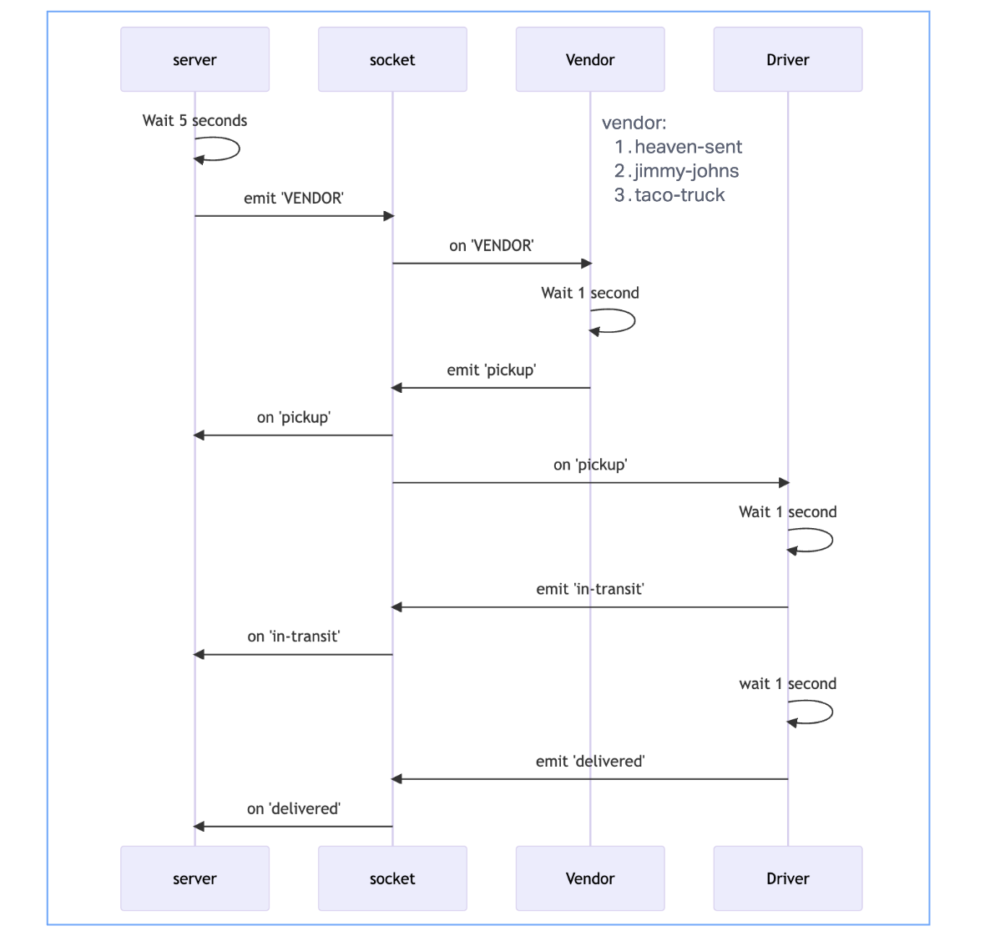

# steve-ash-lab14

## project description

Create a new application using real-time events.
Requirements
Application must employ the following programming concepts:
A “hub” server that moderates all events
Multiple “clients” that connect to the hub which can both publish and subscribe to events
Must operate over a network

## author

Steve Gant
Ashwini Uppal

## Features and Implementation

### Hub Server

The hub server is the central server that all clients connect to. It is responsible for moderating all events and sending them to the appropriate clients. The hub server is implemented using a TCP server. The hub server is responsible for the following:

* Maintaining a list of all connected clients
* Sending events to all connected clients
* Sending events to a specific client
* creating rooms for clients to join
* sending events to a specific room

## tests
 Tested the functionality like creating rooms, sending events to a specific room, sending events to a specific client, sending events to all connected clients, pickup/delivery messages are working as expected.

 #UML

